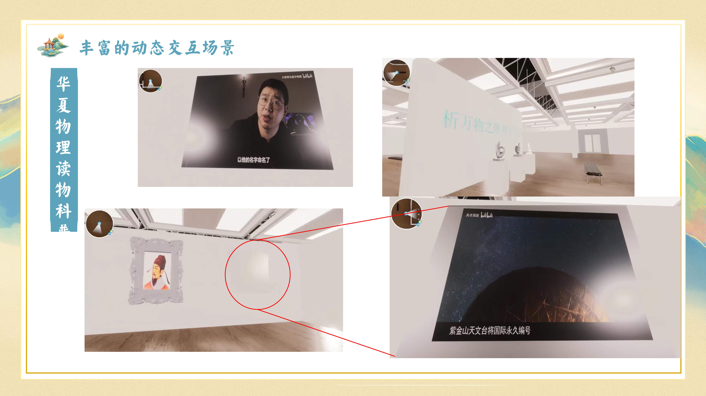
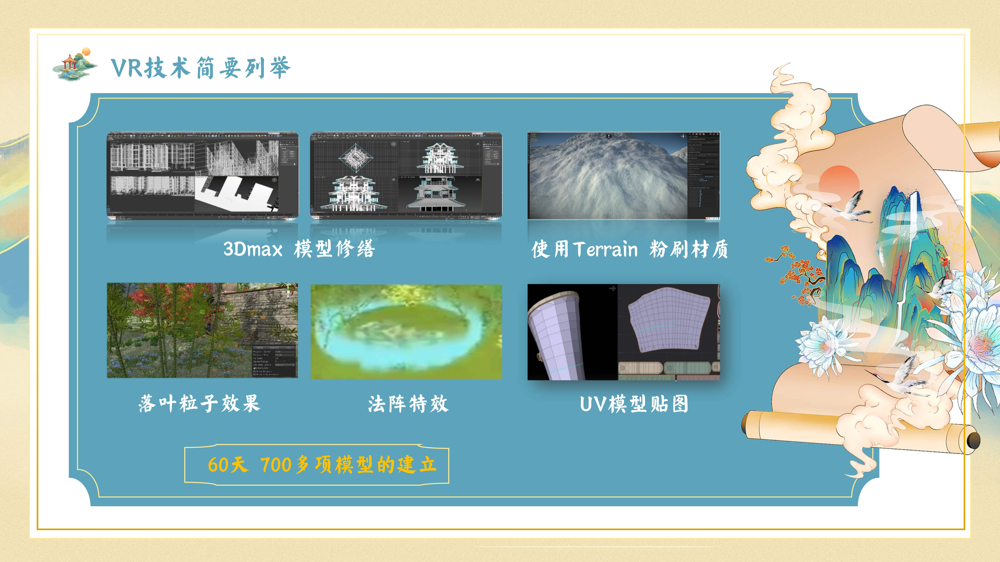
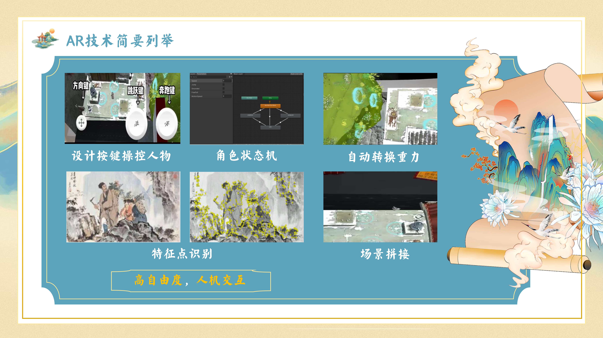
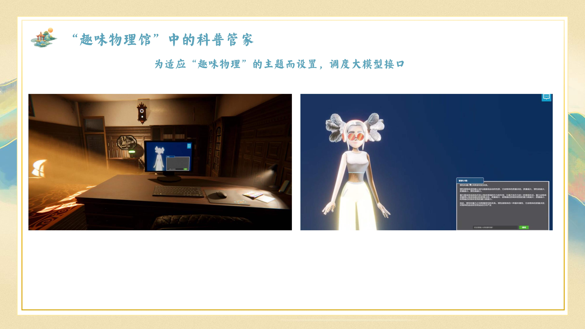
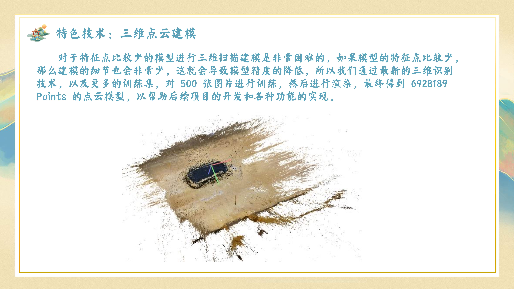
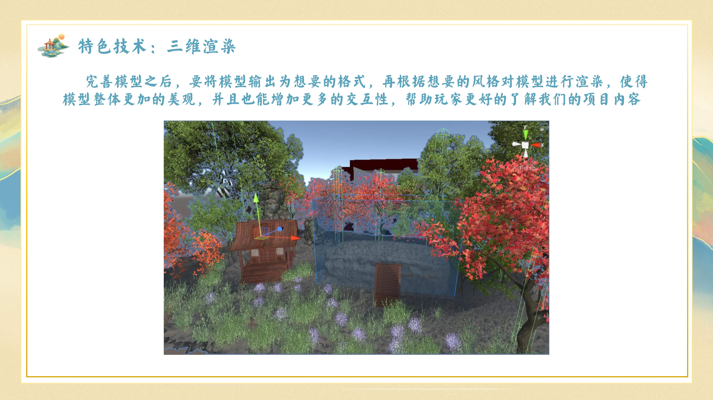
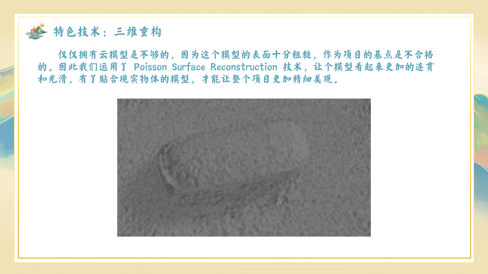

# 细数华夏物理珠玑 - 中国古代物理VR/AR交互体验
🏆 2025年中国大学生计算机设计大赛 数媒游戏与交互设计-虚拟现实VR与增强现实AR普通组 作品

## 项目介绍
本作品围绕"中国古代物理"主题进行开发设计，使用户能够在虚拟环境中拥有沉浸式感受中国古代物理文化的体验，以寓教于乐的方式向用户科普传统中国古代的璀璨物理成就并体悟其魅力。

之所以称为“交互设计集”，是因为我们以pdf文件的形式制作了一份图片集，并为每张图片都搭建了对应的AR场景。

同时我们实现了VR和AR交互逻辑的兼容，能够在VR环境中调用AR功能场景，通过找到VR场景中的对应位置，可以进入到AR功能场景，完成AR任务后又可以跳转到另外的VR场景。

用户可以：

1. 下载VR的可执行文件（.exe），从VR部分开始游览
2. 直接通过工程文件（.apk）安装“细数华夏物理珠玑”APP，然后使用APP中的扫描功能对设计集中的对应图片进行扫描

即可完成一段美妙的中国古代物理成就体验之旅~

当然，安装会略花时间，所以方便起见，可以考虑通过**作品设计文档/作品演示视频**感受本作品的内容和质量！


## 功能特点
- 丰富的动态交互场景：身临其境的华夏物理科普博物展



- VR/AR交互逻辑兼容：在VR环境中调用AR功能场景
- 两种游玩方式：VR完整体验或单独AR体验
- 丰富的物理算法实现：重力平衡、场景拼接、物体惯性等





- 智能问答系统：本地部署大语言模型实现物理知识问答



## 使用说明
### 手动构建
1. 确保已安装Unity 2021或更高版本
2. 导入项目到Unity Hub
3. 安装必要插件和SDK：
   - AR Foundation
   - XR Interaction Toolkit
   - TextMeshPro
4. 关键代码示例：
```csharp
// PlayerController.cs 中的移动控制核心代码
public class PlayerController : MonoBehaviour
{
    public float moveSpeed = 5f;
    private CharacterController controller;

    void Start()
    {
        controller = GetComponent<CharacterController>();
    }

    void Update()
    {
        Vector3 move = new Vector3(Input.GetAxis("Horizontal"), 0, Input.GetAxis("Vertical"));
        controller.Move(move * Time.deltaTime * moveSpeed);
    }
}
```

```csharp
// SceneChange.cs 中的场景切换核心代码
public class SceneChange : MonoBehaviour
{
    public string sceneName;
    
    void OnTriggerEnter(Collider other)
    {
        if(other.CompareTag("Player"))
        {
            SceneManager.LoadScene(sceneName);
        }
    }
}
```
5. 构建设置：
   - 选择目标平台(Windows/Android)
   - 配置Player Settings
   - 构建生成可执行文件

### 游玩方式1：VR完整体验

- 点开项目的exe运行文件，可以进入到我们的展馆，展馆采用HDRP渲染管线，在unity中有更真实的灯管渲染。
- 我们实现了VR和AR交互逻辑的兼容，能够在VR环境中调用AR功能场景：在展馆中我们可以根据左上方的小地图进行查看自己的相对位置，我们找到场馆中的地图模型展示处，可以进入到我们AR功能场景。
- 在AR功能场景中，通过AR扫描识别图片即可以展示我们的建模。
- 我们采用重力平衡算法、场景拼接算法、场景稳定算法、物体惯性算法、地面摩擦力算法、碰撞检测算法等实现了可以通过视频视觉的方式，控制小球的移动和感知，当小球走通迷宫时就能够进入我们新的场景：如团队成员介绍场（内含我们的团队成员和创作历程介绍）、智能文化大模型问答室（通过本地部署大语言模型，通过局域网通信能够在VR环境中实现关于物理知识问答的智能数字人问答系统，并且数字人通过Azure语音合成技术生成语音回答问题，可以根据人物模型更换语音音效）。

1. 下载VR可执行文件(.exe)
2. 运行进入展馆（采用HDRP渲染管线）
3. 根据小地图找到AR功能场景入口
4. 通过AR扫描识别图片展示建模
5. 完成物理挑战进入新场景：
   - 团队成员介绍场
   - 智能文化大模型问答室

### 游玩方式2：单独AR体验
1. 安装"细数华夏物理珠玑"APP(.apk)
2. 使用APP扫描功能对设计集图片进行扫描
3. 直接体验AR功能场景

## 技术实现
- Unity引擎开发
- HDRP高清渲染管线
- 多种物理算法实现：
  - 重力平衡算法
  - 场景拼接算法
  - 场景稳定算法
  - 物体惯性算法
  - 地面摩擦力算法
  - 碰撞检测算法
- 本地部署大语言模型
- Azure语音合成技术
- 三维点云建模



- 三维渲染



- 三维重构



## 体验建议
安装过程可能需要一些时间，您也可以通过以下方式快速了解作品：
- 查看作品设计文档
- 观看作品演示视频

祝您体验愉快！